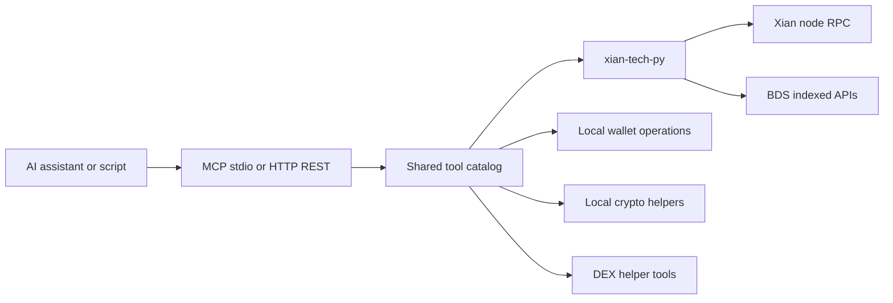

# xian-mcp-server

`xian-mcp-server` is a Model Context Protocol (MCP) server that exposes the
Xian blockchain to AI assistants and HTTP clients. It wraps `xian-tech-py`
to offer wallet management, transactions, smart-contract reads and writes,
indexed BDS reads, shielded wallet sync, token discovery, DEX trading, and
cryptographic operations through a single tool catalog.

The server speaks two transports:

| Mode             | Transport                       | Use case                                  |
| ---------------- | ------------------------------- | ----------------------------------------- |
| **MCP (stdio)**  | JSON-RPC over `stdin` / `stdout` | Claude Desktop, LM Studio, MCP clients    |
| **HTTP (REST)**  | JSON over HTTP                  | Web apps, AI tool-calling loops, scripts  |

> ⚠️ **LOCAL USE ONLY.** The server handles private keys. Do not expose it
> to the internet or use it with production wallets.

See [CLAUDE.md](CLAUDE.md) for the full AI-facing tool reference and
chain-specific concepts (chi, state-key format, address vs. public key,
DEX workflow, error patterns).

## Request Shape



## Quick Start

Build the Docker image (recommended):

```bash
git clone https://github.com/endogen/xian-mcp-server.git
cd xian-mcp-server
docker compose build
```

Or build against a sibling SDK checkout:

```bash
docker buildx build --target local --load -t xian-mcp-server \
  --build-context xian_py=../xian-py \
  --build-context xian_accounts=../xian-contracting/packages/xian-accounts \
  --build-context xian_runtime_types=../xian-contracting/packages/xian-runtime-types \
  .
```

Smoke-test the MCP handshake:

```bash
docker run --rm -i xian-mcp-server < test_requests.jsonl
# or, without Docker:
uv run xian-mcp-server < test_requests.jsonl
uv run python xian_server.py < test_requests.jsonl
```

You should see two JSON responses: an `initialize` response (id 1) and a
`tools/list` response (id 2).

### Use with Claude Desktop

Edit your Claude Desktop config (`~/Library/Application Support/Claude/claude_desktop_config.json`
on macOS, `%APPDATA%\Claude\claude_desktop_config.json` on Windows,
`~/.config/Claude/claude_desktop_config.json` on Linux):

```json
{
  "mcpServers": {
    "xian": {
      "command": "docker",
      "args": ["run", "-i", "--rm", "xian-mcp-server"]
    }
  }
}
```

Quit Claude Desktop fully and restart it; the Xian tools will be available.

### Use with LM Studio

In LM Studio's **Program** sidebar, choose **Install → Edit mcp.json** and
add:

```json
{
  "xian": {
    "command": "docker",
    "args": ["run", "-i", "--rm", "xian-mcp-server"]
  }
}
```

LM Studio reloads MCP servers automatically when the file is saved.

### Run the HTTP Server

```bash
docker compose up xian-mcp-http             # via Docker Compose
docker run -p 8100:8100 xian-mcp-server xian-mcp-http
uv run xian-mcp-http                        # bare-metal
```

Endpoints:

| Method | Path                | Description                                     |
| ------ | ------------------- | ----------------------------------------------- |
| `GET`  | `/tools`            | List all tools with their JSON-Schema params    |
| `POST` | `/tools/{name}`     | Call a tool by name with a JSON body            |
| `GET`  | `/health`           | Health check                                    |

```bash
curl http://localhost:8100/tools
curl -X POST http://localhost:8100/tools/create_wallet
curl -X POST http://localhost:8100/tools/get_balance \
     -H "Content-Type: application/json" \
     -d '{"address": "your_address_here"}'
```

The HTTP wrapper (`http_server.py`) is designed to be reusable with any MCP
server that uses the `TOOL_SPECS` pattern; see the source for the
`create_app(tool_specs=...)` helper.

## Principles

- **Local-only by default.** The server is built around private-key
  custody. It must not be exposed to the internet or paired with production
  wallets.
- **Two transports, one tool catalog.** Stdio MCP and HTTP REST expose the
  exact same tools and schemas. The transport is a thin shell.
- **AI-friendly safety conventions.** Errors return human-readable strings.
  Private keys are never logged or echoed in responses. Confirmation is
  expected for any value-moving operation; see [CLAUDE.md](CLAUDE.md).
- **`xian-tech-py` is the only SDK.** All blockchain interactions go
  through `xian-tech-py`'s sync / async clients. Indexed reads are
  thin wrappers over the SDK's BDS surface.
- **Read-mostly indexed surface.** BDS-backed reads (blocks, txs, events,
  state history, shielded sync) are read-only and most useful when pointed
  at a service node with indexed APIs enabled.

## Tool Surface

| Group              | Tools (representative)                                                                                                  |
| ------------------ | ----------------------------------------------------------------------------------------------------------------------- |
| Wallets            | `create_wallet`, `create_wallet_from_private_key`, `create_hd_wallet`, `create_hd_wallet_from_mnemonic`                 |
| Balances / txs     | `get_balance`, `get_token_balances`, `send_tokens`, `send_transaction`, `get_transaction`, `simulate_transaction`        |
| Contracts / state  | `get_contract_source`, `get_state`                                                                                              |
| Token discovery    | `get_token_contract_by_symbol`, `get_token_data_by_contract`                                                             |
| DEX                | `get_dex_price`, `buy_on_dex`, `sell_on_dex`                                                                             |
| Indexed / BDS      | `get_bds_status`, `get_developer_rewards`, `list_blocks`, `get_block`, `get_block_by_hash`, `get_indexed_tx`, `list_txs_for_block`, `list_txs_by_sender`, `list_txs_by_contract`, `get_events_for_tx`, `list_events`, `get_state_history`, `get_state_for_tx`, `get_state_for_block` |
| Shielded sync      | `list_shielded_output_tags`, `list_shielded_wallet_history`                                                              |
| Crypto             | `sign_message`, `verify_signature`, `encrypt_message`, `decrypt_message`                                                 |

Use `tools/list` (see `test_requests.jsonl`) to discover the full schema.

## Configuration

| Variable           | Purpose                                                | Default                                |
| ------------------ | ------------------------------------------------------ | -------------------------------------- |
| `XIAN_NODE_URL`    | Node RPC URL                                           | `https://node.xian.org`                |
| `XIAN_CHAIN_ID`    | Chain ID                                               | `xian-1`                               |
| `XIAN_GRAPHQL`     | GraphQL endpoint                                       | `https://node.xian.org/graphql`        |
| `XIAN_INCLUDE_RAW` | Include SDK `raw` payloads in MCP / HTTP responses     | `false`                                |

For testnet, use `https://testnet.xian.org` and `xian-testnet-12`. Drop
these into a `.env` file (template in `.env.example`) when using
`docker-compose`.

## Key Files

- `xian_server.py` — stdio MCP server entrypoint.
- `http_server.py` — reusable HTTP REST wrapper around the same tool specs.
- `serialization.py` — JSON-RPC and tool-result serialization helpers.
- `mcp.json`, `custom_catalog.yaml` — example client configurations.
- `test_requests.jsonl` — canonical MCP handshake smoke input.
- `tests/` — `unit/` (deterministic) and `integration/` (live-network)
  coverage; shared fixtures in `tests/shared.py`.
- `Dockerfile`, `docker-compose.yml` — container build and runtime
  topology.
- `CLAUDE.md` — AI assistant integration guide and detailed tool
  reference.

## Validation

```bash
uv sync --extra dev
uv run pytest -q                       # deterministic unit tests
uv run pytest -q tests/integration     # live-network integration tests (configure tests/shared.py)
docker run --rm -i xian-mcp-server < test_requests.jsonl   # MCP handshake smoke test
```

CI runs unit tests and the MCP handshake smoke test on every push and PR.
Live integration tests run on a daily schedule and via manual
`workflow_dispatch`.

## Related Docs

- [CLAUDE.md](CLAUDE.md) — AI-assistant integration guide, full tool
  reference, security guidelines, common workflows
- [test_requests.jsonl](test_requests.jsonl) — canonical MCP handshake
  smoke input
- `xian-tech-py` — the underlying Python SDK
