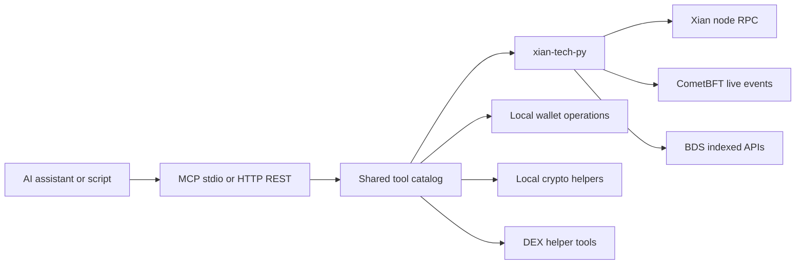

# xian-mcp-server

`xian-mcp-server` is a Model Context Protocol (MCP) server that exposes the
Xian blockchain to AI assistants and HTTP clients. It wraps `xian-tech-py`
to offer wallet management, transactions, smart-contract reads and writes,
indexed BDS reads, shielded wallet sync, token discovery, DEX trading, and
cryptographic operations through a single tool catalog.

The server speaks two transports:

| Mode             | Transport                       | Use case                                  |
| ---------------- | ------------------------------- | ----------------------------------------- |
| **MCP (stdio)**  | JSON-RPC over `stdin` / `stdout` | Claude Desktop, LM Studio, MCP clients    |
| **HTTP (REST)**  | JSON over HTTP                  | Web apps, AI tool-calling loops, scripts  |

> ⚠️ **LOCAL USE ONLY.** The server handles private keys. Do not expose it
> to the internet or use it with production wallets.

See [CLAUDE.md](CLAUDE.md) for the full AI-facing tool reference and
chain-specific concepts (chi, state-key format, address vs. public key,
DEX workflow, error patterns).

## Request Shape



## Quick Start

Build the Docker image (recommended):

```bash
git clone https://github.com/xian-technology/xian-mcp-server.git
cd xian-mcp-server
docker compose build
```

Or build against a sibling SDK checkout:

```bash
docker buildx build --target local --load -t xian-mcp-server \
  --build-context xian_py=../xian-py \
  --build-context xian_accounts=../xian-contracting/packages/xian-accounts \
  --build-context xian_runtime_types=../xian-contracting/packages/xian-runtime-types \
  .
```

Smoke-test the MCP handshake:

```bash
docker run --rm -i xian-mcp-server < test_requests.jsonl
# or, without Docker:
uv run xian-mcp-server < test_requests.jsonl
uv run python xian_server.py < test_requests.jsonl
```

You should see two JSON responses: an `initialize` response (id 1) and a
`tools/list` response (id 2).

### Use with Claude Desktop

Edit your Claude Desktop config (`~/Library/Application Support/Claude/claude_desktop_config.json`
on macOS, `%APPDATA%\Claude\claude_desktop_config.json` on Windows,
`~/.config/Claude/claude_desktop_config.json` on Linux):

```json
{
  "mcpServers": {
    "xian": {
      "command": "docker",
      "args": ["run", "-i", "--rm", "xian-mcp-server"]
    }
  }
}
```

Quit Claude Desktop fully and restart it; the Xian tools will be available.

### Use with LM Studio

In LM Studio's **Program** sidebar, choose **Install → Edit mcp.json** and
add:

```json
{
  "xian": {
    "command": "docker",
    "args": ["run", "-i", "--rm", "xian-mcp-server"]
  }
}
```

LM Studio reloads MCP servers automatically when the file is saved.

### Run the HTTP Server

```bash
uv run xian-mcp-http                               # bare-metal
export XIAN_MCP_HTTP_TOKEN="$(openssl rand -hex 32)"
# Optional: publish Docker Compose HTTP on IPv6 loopback instead of IPv4.
# export HTTP_PUBLISH_HOST="::1"
docker compose up xian-mcp-http
docker run -p 127.0.0.1:8100:8100 \
  -e HTTP_HOST=0.0.0.0 \
  -e XIAN_MCP_HTTP_TOKEN="${XIAN_MCP_HTTP_TOKEN}" \
  xian-mcp-server xian-mcp-http
```

Endpoints:

| Method | Path                | Description                                     |
| ------ | ------------------- | ----------------------------------------------- |
| `GET`  | `/tools`            | List all tools with their JSON-Schema params    |
| `POST` | `/tools/{name}`     | Call a tool by name with a JSON body            |
| `GET`  | `/health`           | Health check                                    |

```bash
curl http://localhost:8100/tools
curl -X POST http://localhost:8100/tools/get_balance \
     -H "Content-Type: application/json" \
     -d '{"address": "your_address_here"}'
```

HTTP binds to `127.0.0.1` by default in bare-metal mode. Docker examples bind
the host port to `127.0.0.1` by default while the process listens on `0.0.0.0`
inside the container. With Compose, set `HTTP_PUBLISH_HOST=::1` to publish the
host port on IPv6 loopback, then call `http://[::1]:8100/tools`.

Unsafe wallet/signing tools are hidden from `GET /tools` and rejected by
`POST /tools/{name}` unless `XIAN_MCP_ENABLE_UNSAFE_WALLET_TOOLS=1` is set.
When unsafe tools are enabled, or when HTTP binds to a non-loopback address, set
`XIAN_MCP_HTTP_TOKEN` and send it as a bearer token. IPv4 loopback,
`localhost`, and IPv6 loopback binds such as `::1` or `[::1]` do not require a
token unless unsafe tools are enabled or a token is explicitly configured. IPv6
wildcard `::` and other non-loopback IPv6 binds require a token.

DEX discovery, quotes, and plans are read-only and remain available with the
unsafe gate disabled. The three `dex_submit_*` tools are value-moving tools and
use the same unsafe-wallet gate and HTTP bearer-token requirements as sends and
legacy DEX helpers. Each planner stores an immutable canonical plan in a
process-local registry and returns its complete audit JSON with an opaque
`plan_id`, SHA-256 digest, issue time, and expiry. After confirmation, pass only
that `plan_id` and the private key to the matching submitter. Submission claims
the stored plan exactly once before wallet validation or network work, simulates
calls by default, then submits its required approvals and exact router call.
Plans expire after five minutes by default, may be evicted at the registry
bound, and do not survive a server restart; create a fresh plan in those cases.

```bash
export XIAN_MCP_ENABLE_UNSAFE_WALLET_TOOLS=1
export XIAN_MCP_HTTP_TOKEN="$(openssl rand -hex 32)"

curl http://localhost:8100/tools \
     -H "Authorization: Bearer ${XIAN_MCP_HTTP_TOKEN}"
curl -X POST http://localhost:8100/tools/create_wallet \
     -H "Authorization: Bearer ${XIAN_MCP_HTTP_TOKEN}"
```

Browser CORS is disabled by default. To allow a local browser client, list exact
origins with `XIAN_MCP_HTTP_CORS_ORIGINS`; wildcard CORS is rejected:

```bash
export XIAN_MCP_HTTP_CORS_ORIGINS="http://localhost:3000,http://127.0.0.1:3000"
```

The HTTP wrapper (`http_server.py`) is designed to be reusable with any MCP
server that uses the `TOOL_SPECS` pattern; see the source for the
`create_app(tool_specs=...)` helper.

## Principles

- **Local-only by default.** The server is built around private-key
  custody. It must not be exposed to the internet or paired with production
  wallets.
- **Two transports, one tool catalog.** Stdio MCP and HTTP REST expose the
  exact same tools and schemas. The transport is a thin shell.
- **AI-friendly safety conventions.** Errors return human-readable strings.
  Private keys are never logged or echoed in responses. Confirmation is
  expected for any value-moving operation; see [CLAUDE.md](CLAUDE.md).
- **`xian-tech-py` is the only SDK.** All blockchain interactions go
  through `xian-tech-py`'s sync / async clients. Live DEX waits use its
  CometBFT WebSocket watcher, while indexed reads wrap its BDS surface.
- **Read-mostly indexed surface.** BDS-backed reads (blocks, txs, events,
  state history, shielded sync) are read-only and most useful when pointed
  at a node with BDS-backed indexed APIs enabled.

## Tool Surface

| Group              | Tools (representative)                                                                                                  |
| ------------------ | ----------------------------------------------------------------------------------------------------------------------- |
| Wallets            | `create_wallet`, `create_wallet_from_private_key`, `create_hd_wallet`, `create_hd_wallet_from_mnemonic`                 |
| Balances / txs     | `get_balance`, `get_token_balances`, `send_tokens`, `send_transaction`, `get_transaction`, `simulate_transaction`        |
| Contracts / state  | `get_contract_source`, `get_state`                                                                                              |
| Token discovery    | `get_token_contract_by_symbol`, `get_token_data_by_contract`                                                             |
| DEX discovery / planning | `dex_list_pairs`, `dex_get_pair`, `dex_quote_exact_in`, `dex_quote_exact_out`, `dex_plan_swap`, `dex_plan_add_liquidity`, `dex_plan_remove_liquidity` |
| DEX events        | `dex_wait_live_event` for bounded low-latency waits without BDS; `dex_list_events` for durable history and restart-safe cursors |
| DEX submission     | `dex_submit_swap`, `dex_submit_add_liquidity`, `dex_submit_remove_liquidity`; legacy single-pair helpers: `buy_on_dex`, `sell_on_dex` |
| Indexed / BDS      | `get_bds_status`, `get_developer_rewards`, `list_blocks`, `get_block`, `get_block_by_hash`, `get_indexed_tx`, `list_txs_for_block`, `list_txs_by_sender`, `list_txs_by_contract`, `get_events_for_tx`, `list_events`, `get_state_history`, `get_state_for_tx`, `get_state_for_block` |
| Shielded sync      | `list_shielded_output_tags`, `list_shielded_wallet_history`                                                              |
| Crypto             | `sign_message`, `verify_signature`, `encrypt_message`, `decrypt_message`                                                 |

Use `tools/list` (see `test_requests.jsonl`) to discover the full schema.

## Configuration

| Variable           | Purpose                                                | Default                                |
| ------------------ | ------------------------------------------------------ | -------------------------------------- |
| `XIAN_NODE_URL`    | Node RPC URL                                           | `http://127.0.0.1:26657`             |
| `XIAN_CHAIN_ID`    | Chain ID                                               | `xian-local-1`                      |
| `XIAN_GRAPHQL`     | GraphQL endpoint                                       | `http://127.0.0.1:5000/graphql`     |
| `XIAN_INCLUDE_RAW` | Include SDK `raw` payloads in MCP / HTTP responses     | `false`                                |
| `XIAN_MCP_ENABLE_UNSAFE_WALLET_TOOLS` | Enable wallet creation/import, signing, encryption/decryption, sends, and DEX trade helpers | `false` |
| `HTTP_HOST`        | HTTP bind address                                      | `127.0.0.1`                            |
| `HTTP_PORT`        | HTTP bind port                                         | `8100`                                 |
| `HTTP_PUBLISH_HOST` | Docker Compose host interface for publishing HTTP mode | `127.0.0.1`                            |
| `XIAN_MCP_HTTP_TOKEN` | Bearer token for HTTP tools; required for unsafe tools or non-loopback binds | unset |
| `XIAN_MCP_HTTP_CORS_ORIGINS` | Comma-separated browser origins allowed to call HTTP mode | unset |
| `XIAN_MCP_DEX_PLAN_TTL_SECONDS` | Process-local DEX plan lifetime (bounded to 30-900 seconds) | `300` |
| `XIAN_MCP_DEX_PLAN_MAX_ENTRIES` | Maximum stored DEX plans before oldest-first eviction (bounded to 1-1000) | `256` |

The defaults target a local current-code stack. Drop overrides into a `.env`
file (template in `.env.example`) when using `docker-compose`.

## Key Files

- `xian_server.py` — stdio MCP server entrypoint.
- `dex_plan_registry.py` — bounded process-local storage for immutable,
  expiring, single-use DEX plans.
- `http_server.py` — reusable HTTP REST wrapper around the same tool specs.
- `serialization.py` — JSON-RPC and tool-result serialization helpers.
- `mcp.json`, `custom_catalog.yaml` — example client configurations.
- `test_requests.jsonl` — canonical MCP handshake smoke input.
- `tests/` — `unit/` (deterministic) and `integration/` (live-network)
  coverage; shared fixtures in `tests/shared.py`.
- `Dockerfile`, `docker-compose.yml` — container build and runtime
  topology.
- `CLAUDE.md` — AI assistant integration guide and detailed tool
  reference.

## Validation

```bash
uv sync --extra dev
uv run pytest -q                       # deterministic unit tests
docker run --rm -i xian-mcp-server < test_requests.jsonl   # MCP handshake smoke test
```

Live-network integration tests are opt-in and submit small transactions against
the configured dev node:

```bash
export XIAN_NODE_URL=http://127.0.0.1:27657
export XIAN_CHAIN_ID=xian-localnet-1
export XIAN_MCP_LIVE_PRIVATE_KEY=<funded-dev-private-key>
export XIAN_MCP_LIVE_TOKEN_SYMBOL=XDT
export XIAN_MCP_LIVE_TOKEN_CONTRACT=con_dex_demo_token
export XIAN_MCP_LIVE_DEX_TOKEN=con_dex_demo_token
export XIAN_MCP_LIVE_DEX_BASE=currency
# Optional: also add and remove a small liquidity position.
export XIAN_MCP_LIVE_DEX_LIQUIDITY=1

uv run pytest -q tests/integration/test_live_tool_surface.py
```

CI runs unit tests and the MCP handshake smoke test on every push and PR.
Live integration tests run on a daily schedule and via manual
`workflow_dispatch`.

## Related Docs

- [CLAUDE.md](CLAUDE.md) — AI-assistant integration guide, full tool
  reference, security guidelines, common workflows
- [test_requests.jsonl](test_requests.jsonl) — canonical MCP handshake
  smoke input
- `xian-tech-py` — the underlying Python SDK
